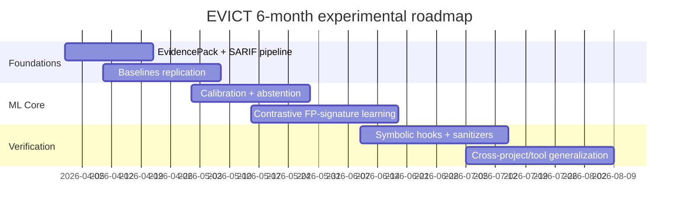

# Evidence-Conditioned LLM Investigation for Static-Analysis Alert Triage

Executive recommendation: Build an **evidence-conditioned LLM verifier** that triages static-analysis alerts using the analyzer’s *own evidence* (trace, slice, constraints), and couples this with **calibrated uncertainty + abstention** and **lightweight symbolic checks** (SMT / targeted symbolic execution) only when needed. Recent systems show that LLMs can drastically raise precision when guided by structured reasoning and precise context extraction (e.g., post-refinement workflows and path-feasibility reasoning), and industry evidence indicates large practical ROI in minutes saved per alert—yet rigorous ML treatment of **risk control, calibration, and cross-tool generalization** remains underdeveloped. This proposal targets a NeurIPS-style contribution by formalizing alert triage as **selective prediction under distribution shift**, introducing **contrastive learning of false-positive signatures**, and delivering a reproducible benchmark suite using public datasets (NASCAR, D2A, Juliet/SARD, CWE-Bench-Java) encoded in SARIF. citeturn7view0turn10view0turn11view1turn13view0turn8view3turn7view5turn7view3

## Literature survey and positioning

A consistent theme in the last 5 years is that **LLMs help most when placed “after” static analysis** as an evidence-aware adjudicator, not as a replacement for analyzers. **BUGLENS** (ASE) proposes a post-refinement framework with a *Structured Analysis Guidance* workflow; it reports improving precision on Linux-kernel taint-style bugs from **0.10 to 0.72** and also discusses correcting previously missed cases. (Paper URL: `https://www.cs.ucr.edu/~zhiyunq/pub/ase25_buglens.pdf`). citeturn7view0turn7view0

Multiple preprints sharpen this idea: **LLM4PFA** frames false positives as largely caused by **infeasible paths** and uses iterative, agentic constraint reasoning to validate reachability given traces and source/sink variables. It reports filtering **72%–96%** of false positives while maintaining high recall in its evaluations. (Paper URL: `https://arxiv.org/abs/2506.10322`). citeturn7view1

Another key bottleneck is **context extraction**. **LLM4FPM** argues that coarse snippets (e.g., whole function bodies) add noise and cost, and proposes eCPG-based slicing plus file-dependency expansion; it reports **F1 > 99%** on Juliet, label-quality improvements on D2A (e.g., from **53% to 86%** in their setting), and >85% false-positive elimination on several open-source projects, with average inspection time around seconds per warning. (Paper URL: `https://arxiv.org/pdf/2411.03079`). citeturn10view0

Industrial evidence is now emerging. A 2026 empirical study at **entity["company","Tencent","tech company china"]** reports that developers spend **10–20 minutes per alarm** manually, and that hybrid LLM + static-analysis techniques can eliminate **94%–98%** of false positives with high recall; it also reports per-alarm runtime and monetary costs in a range of seconds and fractions of a dollar. (Paper URL: `https://arxiv.org/abs/2601.18844`). citeturn11view1

Adjacent research strengthens the ML angle: **LLMDFA** (NeurIPS 2024) shows that decomposition + external tool checks (e.g., parsing, theorem proving) can reduce hallucination in code reasoning by offloading delicate reasoning to verification tools. (Paper URL: `https://proceedings.neurips.cc/paper_files/paper/2024/file/ed9dcde1eb9c597f68c1d375bbecf3fc-Paper-Conference.pdf`). citeturn7view4 Additionally, **LLMSAN** (Findings of EMNLP 2024) explicitly treats hallucinated bug paths as false positives and introduces “sanitizers” to validate data-flow path properties; it also shows that CoT and self-consistency do not reliably mitigate hallucinations. (Paper URL: `https://aclanthology.org/2024.findings-emnlp.217.pdf`). citeturn8view0

For datasets and evaluation practices, classic ML-based false-positive filtering work remains important. **D2A** (2021) uses *differential analysis* on before/after bug-fix commits to label analyzer issues and notes that static analyzers generate excess false positives; it also provides explicit caveats about “very likely” labels. (Paper URL: `https://arxiv.org/pdf/2102.07995`). citeturn14view0 **Kang et al.** (ICSE 2022) show that “golden feature” performance can be inflated by **data leakage and duplication**, and that common heuristic labeling can disagree with humans—directly motivating leakage-resistant splits and calibration-aware evaluation. (Paper URL: `https://arxiv.org/pdf/2202.05982`). citeturn13view0

To broaden with program understanding, triage, and repair: large code LMs (e.g., CodeT5+) are established building blocks for code understanding and generation. (Paper URL: `https://aclanthology.org/2023.emnlp-main.68.pdf`). citeturn8view7 Real-world SE benchmarks (SWE-bench) show repository-scale tasks are hard and highlight the importance of tool feedback loops. (Paper URL: `https://proceedings.iclr.cc/paper_files/paper/2024/file/edac78c3e300629acfe6cbe9ca88fb84-Paper-Conference.pdf`). citeturn8view4 Program-repair work using LLMs (e.g., conversational repair and fine-tuning studies) underscores the need for **verification signals** (tests) and cost-aware search, which parallels our need for verifiable evidence in alert adjudication. (URLs: `https://lingming.cs.illinois.edu/publications/issta2024.pdf`, `https://zhangj111.github.io/files/ASE23_APR_Study.pdf`). citeturn8view5turn8view6

## Problem definition and formalization

**Static-analysis alert triage** is the task of deciding which warnings are real and worth developer time. In practice, warnings may be “true bug,” “false positive,” or “non-actionable” due to risk/benefit or project policy; large datasets show that the same rule patterns can produce both actionable and non-actionable outcomes, implying **context matters beyond rule id**. citeturn7view5turn13view0

We formalize each alert \(i\) as an evidence-conditioned instance \((x_i, y_i)\), where \(x_i\) is an **EvidencePack** and \(y_i\in\{\text{TP},\text{FP}\}\) (or \(\{\text{TP},\text{FP},\text{UNCERTAIN}\}\) for human-in-the-loop). EvidencePack includes alert metadata, localized code slices, analyzer-produced flows (taint/value-flow paths), and optional extracted constraints, mirroring the design used by post-refinement systems and feasibility frameworks. citeturn7view0turn7view1turn10view0

The triage objective can be framed in three standard ML formulations. **Binary classification**: minimize false positives while preserving recall on true bugs (or vice versa depending on risk tolerance). **Ranking**: score alerts \(s(x_i)\) so that reviewing the top \(k\) yields high precision@k and recall@k. **Selective prediction (abstention)**: output either a label or “defer,” optimizing a **risk–coverage tradeoff** where the system only auto-adjudicates when calibrated confidence is sufficient. citeturn13view0turn8view1turn11view1

**Evaluation metrics** should reflect both security quality and human cost. Required metrics include (i) FPR / precision / recall / F1, (ii) precision@k, recall@k, NDCG@k for ranking, (iii) calibration metrics like ECE and Brier score, and (iv) human-in-the-loop cost proxies such as minutes saved per 1k alerts and remaining manual workload under abstention. Tencent’s study provides concrete cost anchors (minutes per alert manually; seconds and dollars per alert under some LLM pipelines), which we can use to report end-to-end utility. citeturn11view1turn16view1

## Taxonomy of LLM-based triage approaches

**LLM-as-oracle (one-shot classifier).** The LLM receives warning + code snippet and outputs TP/FP. This is easy to deploy but brittle with long contexts, unreliable rationales, and poor calibration, especially under project shift. Evidence-focused studies show that prompt-only methods vary and often need better context extraction. citeturn10view0turn11view1

**LLM-as-explainer (human decides).** The LLM summarizes evidence and produces a rationale; humans still adjudicate. This can improve trust and throughput, and is consistent with practical adoption patterns emphasizing transparency. However, it does not directly optimize false-positive reduction and can still hallucinate explanations. citeturn17view0turn16view1

**LLM-as-verifier (claim checking over evidence).** The LLM is constrained to validate/refute the analyzer’s claim using the analyzer’s trace and a precise slice, often via a structured workflow. BUGLENS’s structured guidance and LLM4PFA’s iterative feasibility reasoning fall into this category and report large precision gains. This is the most promising family for FP reduction because it transforms “reasoning” into “evidence-conditioned verification.” citeturn7view0turn7view1turn10view0

**Hybrid symbolic–LLM pipelines.** The LLM extracts constraints or proposes checks; SMT / parsing / theorem proving validates them. LLMDFA, LLMSAN, and LLM4PFA exemplify the value of offloading brittle steps to deterministic tooling, which reduces hallucination-driven false positives. The downside is operational complexity and potential runtime overhead, motivating conditional invocation (only for uncertain cases). citeturn7view4turn8view0turn7view1

## Proposed method with novelty claims

We propose **EVICT** (Evidence-conditioned Verifier for Investigating Code Triage), a pipeline that converts each static-analysis alert into a structured evidence bundle, then performs calibrated, selective adjudication and optionally triggers symbolic checks.

**Novelty claims** (relative to strong recent systems).  
- **Risk-controlled adjudication**: EVICT treats alert triage as **selective prediction** under asymmetric costs, explicitly optimizing risk–coverage and calibrating confidence; this is not the primary focus of prior post-refinement systems that mostly report precision/recall. citeturn11view1turn8view1turn13view0  
- **False-positive signature learning**: EVICT introduces **contrastive learning over EvidencePacks** to model recurring false-positive “signatures” (e.g., infeasible path motifs, missing context patterns) and to improve cross-project generalization while controlling leakage via deduplication-aware sampling. This directly addresses ICSE’22 concerns about duplication and label leakage. citeturn13view0turn10view0  
- **Verifier with symbolic hooks and abstention**: EVICT integrates lightweight SMT / targeted symex *conditionally* (uncertain or high-impact cases) and produces auditable certificates (SAT/UNSAT, reachability checks), combining the strengths of LLM4PFA and sanitization approaches while controlling cost and hallucination. citeturn7view1turn8view0turn7view4  
- **Standardized evidence interchange**: EVICT encodes alerts and evidence using **SARIF** as a lingua franca, enabling cross-tool evaluation and reproducibility across analyzers and projects. (Spec URL: `https://docs.oasis-open.org/sarif/sarif/v2.1.0/os/sarif-v2.1.0-os.pdf`). citeturn8view3

**EvidencePack schema.** For each alert, build:
- **Alert core**: rule/CWE, severity/confidence, SARIF locations.
- **Minimal slice**: statement-level slice around source/sink + dependency slice along the analyzer-reported flow; optionally CPG-based slice if available (as in context-focused systems). citeturn10view0turn7view3  
- **Flow trace**: a normalized representation of the analyzer’s path (call chain, taint edges).
- **Constraints**: extracted branch predicates / guards; if missing, the LLM can request additional context in a bounded multi-turn loop (“progressive prompting”), inspired by static+LLM integrated systems. citeturn7view1turn17view2

**Decision logic.** EVICT outputs \((\hat{p}, d, r)\), where \(\hat{p}\) is a calibrated TP probability, \(d \in \{\text{TP},\text{FP},\text{ABSTAIN}\}\), and \(r\) is a structured rationale with references to evidence artifacts. For ABSTAIN, the system routes to human triage and logs “missing evidence requests” to guide future context extraction improvements. citeturn17view0turn13view0

**Pipeline flowchart.**

```mermaid
flowchart TD
  A[Static analyzer output] --> B[SARIF normalization]
  B --> C[EvidencePack builder\n(slice + flow + constraints)]
  C --> D[LLM Verifier\nschema-guided claim checking]
  D --> E{Uncertainty\n& calibration}
  E -->|confident| F[Auto-adjudicate\nTP/FP + rationale]
  E -->|uncertain| G[ABSTAIN\nhuman-in-loop]
  D --> H[Optional symbolic hooks\nSMT / lightweight symex]
  H --> D
  F --> I[Feedback labels\n(fixes, reviews, suppressions)]
  G --> I
  I --> C
  I --> D
```

citeturn8view3turn7view1turn8view0

## Experimental design and evaluation protocol

A NeurIPS-quality evaluation must be **leakage-resistant**, **shift-aware**, and **utility-centric**. We propose a tiered dataset strategy that combines synthetic benchmarks, large-scale actionability corpora, and realistic vulnerability benchmarks.

**Datasets and benchmarks.**
- **NASCAR**: >1M Java warnings labeled actionable/non-actionable, released with tools and data (links: `https://www.nature.com/articles/s41597-025-06154-7`, `https://zenodo.org/records/17079912`). citeturn7view5turn7view6  
- **D2A**: differential-analysis–labeled static-analysis issues from bug-fix commit pairs; includes traces/outputs and explicitly targets false-alarm reduction. (Links: `https://arxiv.org/pdf/2102.07995`, repo link included in paper). citeturn14view0  
- **Juliet / SARD**: synthetic labeled buggy/bug-free cases; useful for controlled verification, and widely used for SAST evaluation. (Link: `https://samate.nist.gov/SARD/test-suites/112`). citeturn12view1turn10view0  
- **CWE-Bench-Java** (from IRIS/ICLR): realistic, manually validated security vulnerabilities in Java projects; crucial for high-stakes evaluation under repo context. (Paper URL: `https://arxiv.org/pdf/2405.17238`). citeturn7view3  
- Optional: SonarQube-style FP datasets from prior ML filtering studies for classic baselines (e.g., large-scale FP filtering dataset releases). (Example dataset page URL: `https://zenodo.org/records/5885654`). citeturn10view3

**Data collection and labeling protocol.**
- Prefer **commit-differential labeling** (D2A-style) as scalable but noisy; explicitly model it as weak supervision and reserve manual auditing for calibration/test sets. citeturn14view0turn13view0  
- For NASCAR, treat “actionable” as a triage target (work-saving), but separate “true vulnerability” from “actionable” when evaluating security findings to avoid conflating “fixed” with “real bug.” citeturn7view5turn13view0  
- Enforce **project-level and time-based splits**, and de-duplicate near-identical warnings to avoid train/test contamination implicated in prior work. citeturn13view0turn10view0

**Baselines.**
- **Static analyzer alone**: raw warning output, severity ranking, and any built-in confidence scores. citeturn7view5  
- **Heuristic filters**: suppression-based / rule-based post-processing (where available), and context-length truncation baselines. citeturn10view0  
- **Classic supervised ML triage**: warning-level classifiers trained on historical features; include a leakage-safe reimplementation guided by ICSE’22. citeturn13view0turn10view3  
- **Prior LLM triage/FP-reduction pipelines**: instantiate representative methods from BUGLENS, LLM4FPM, and LLM4PFA as strong baselines. citeturn7view0turn10view0turn7view1  
- **Neuro-symbolic bug reasoning baselines**: LLMDFA-style decomposition + tool checks for specific bug types. citeturn7view4

**Metrics and statistical tests.**
- Classification: precision/recall/F1, FPR, AUC, and class-conditional calibration (ECE/Brier). citeturn13view0turn11view1  
- Ranking: precision@k / recall@k / NDCG@k (k aligned to realistic review budgets). citeturn11view1turn7view5  
- Selective prediction: risk–coverage curves, coverage at fixed risk (e.g., ≤1% FN among auto-dismissed FPs, or ≤5% FP among auto-confirmed TPs, depending on workflow). citeturn8view1turn11view1  
- Tests: use paired bootstrap CIs over projects; McNemar tests for paired classification; avoid IID assumptions by clustering within projects/files. citeturn13view0

**Ablations (required for NeurIPS rigor).**
- EvidencePack ablation: function-only vs slice vs slice+trace vs slice+trace+constraints. citeturn10view0turn7view1  
- Verifier scaffold ablation: unstructured prompting vs schema-guided verification vs multi-turn investigation. citeturn7view0turn17view2  
- Uncertainty ablation: self-consistency entropy vs logit-based margins vs conformal wrappers for API-only settings. citeturn8view1turn8view0  
- Symbolic hook ablation: no hooks vs SMT-only vs symex-only vs conditional hooks. citeturn7view1turn7view4

**Datasets and resource estimate table.**

| Dataset / Benchmark | What it provides | Why it matters for EVICT | Scale signal | Expected compute footprint |
|---|---|---|---|---|
| NASCAR (`https://zenodo.org/records/17079912`) | Actionable vs non-actionable Java warnings + generator tools | Large-scale supervised learning and calibration; realistic “actionability” task | “>1 million” warnings reported | Training: moderate (LoRA) / Inference: large batch scoring citeturn7view6turn7view5 |
| D2A (`https://arxiv.org/pdf/2102.07995`) | Differential labels from bug-fix commit pairs with analyzer outputs | Weak supervision + realistic FP reduction; also tests label-noise handling | Millions of issues originally; labeled uniques reported | Training: moderate; emphasize noise-robust learning citeturn14view0 |
| Juliet/SARD (`https://samate.nist.gov/SARD/test-suites/112`) | Synthetic labeled buggy/bug-free cases | Controlled feasibility checks and ground truth; SATE-style evaluation | 64,099 C/C++ testcases in suite #112 | Low-to-moderate; can subsample for rapid prototyping citeturn12view1 |
| CWE-Bench-Java (IRIS) (`https://arxiv.org/pdf/2405.17238`) | Manually vetted vulnerabilities in real Java projects | High-stakes evaluation + repository context | 120 vulnerabilities reported | Higher per-instance cost (repo context); smaller dataset citeturn7view3 |
| Sonar-style FP dataset (`https://zenodo.org/records/5885654`) | Labeled warning samples from many projects | Classic ML baseline and cross-tool transfer tests | 224,484 samples reported | Low-to-moderate; useful for transfer learning citeturn10view3 |

## Model and training details with uncertainty and symbolic integration

Because the target model family is **unspecified**, EVICT is designed to work in two operational regimes. With API-only GPT-style models (logits hidden), we rely on prompt engineering, self-consistency, and conformal wrappers that do not require logit access. With open Llama-style models, we additionally use logits for stronger calibration and can fine-tune adapters (LoRA) on large warning corpora. citeturn8view1turn15view0turn10view0

**Prompting and representation.**
- Use a **schema-constrained verifier prompt** that forces the LLM to (i) restate the analyzer claim, (ii) list necessary preconditions, (iii) check each precondition against evidence, and (iv) output TP/FP/ABSTAIN with a confidence score and referenced evidence IDs. This mirrors structured guidance designs reported effective in post-refinement systems. citeturn7view0turn17view0  
- Limit context length via EvidencePack minimization; context extraction is a first-class algorithmic component (as LLM4FPM emphasizes). citeturn10view0turn11view1

**Fine-tuning vs few-shot.**
- Start with **few-shot** using curated TP/FP exemplars per rule/CWE; empirically, prompt strategy variation materially affects FP vs TP tradeoffs in production-like workflows. citeturn17view1turn11view1  
- Progress to **parameter-efficient fine-tuning (LoRA)** on NASCAR/D2A, with strict de-duplication and project-based splits to avoid data leakage issues highlighted in ICSE’22. citeturn13view0turn15view0turn14view0  
- For contrastive FP-signature learning, train an embedding head on EvidencePack representations with hard-negative mining (e.g., same rule, similar slice, different label), explicitly controlling for train/test contamination. citeturn13view0

**Calibration and uncertainty estimation.**
- If logits are accessible, apply **temperature scaling** for post-hoc calibration (foundational but effective). (Classic URL: `https://arxiv.org/abs/1706.04599`). citeturn6search1  
- If logits are not accessible, use **conformal prediction for LLMs without logit access** to build uncertainty estimates with statistical guarantees. (Paper URL: `https://aclanthology.org/2024.findings-emnlp.54.pdf`). citeturn8view1  
- Use ensemble-style uncertainty: self-consistency vote entropy and/or stochastic decoding; note that self-consistency does not always mitigate hallucination in code reasoning tasks, motivating additional tool checks. citeturn8view0

**Symbolic checks and lightweight symbolic execution.**
- For path-feasibility-dominated false positives, extract branch constraints and invoke SMT solvability (SAT/UNSAT) as a certificate, inspired by LLM4PFA’s feasibility focus. citeturn7view1  
- For data-flow hallucinations, validate syntactic/semantic properties of reported flows using parsers and sanitizer checks (LLMSAN-style), then feed results back to the verifier stage. citeturn8view0  
- Use conditional invocation: only trigger symbolic hooks when confidence is borderline or when the action is costly (e.g., auto-dismissing a high-severity security alert). This aligns with the industrial emphasis on cost-effectiveness per alarm. citeturn11view1

## Challenges, ethics, reproducibility, and roadmap

**Key technical challenges.** Hallucinations and spurious rationales are well-documented in LLM bug reasoning, and self-consistency can fail to reliably fix them, motivating hybrid verification. citeturn8view0turn7view4 Distribution shift is severe: warning actionability and FP patterns vary by project practices and tool configurations, and naive “oracle” labels can be unstable or disagree with humans. citeturn13view0turn7view5 Label noise is pervasive in auto-labeled datasets; even D2A explicitly frames labels as “very likely” and reports limited label accuracy, while later pipelines attempt to improve label quality through better context. citeturn14view0turn10view0

**Mitigations.** Use conservative automation by default: abstain when uncertain, and calibrate thresholds to meet explicit risk budgets. citeturn11view1turn8view1 Require evidence-grounded outputs with citations to slice/trace IDs; integrate symbolic certificates for high-impact or borderline calls. citeturn7view1turn8view0 Evaluate with leakage-resistant protocols (project/time splits, de-duplication, cluster-aware CIs), per ICSE’22 guidelines. citeturn13view0

**Safety and ethical considerations.** Over-filtering true positives can silently increase risk, especially for security findings. We mitigate this by (i) using ABSTAIN for high-risk cases, (ii) separating workflows for “suggested FP” vs “auto-dismissed,” and (iii) logging rationales and certificates for auditing. Industrial and government-oriented discussions emphasize that LLM guidance should reduce fatigue while preserving analyst judgment and traceability. citeturn17view0turn17view1turn11view1

**Reproducibility plan.** Use SARIF for tool-agnostic alert interchange and publish the EvidencePack schema plus conversion utilities. citeturn8view3 Release cleaned dataset splits with stable hashes for deduplication and document the labeling pipeline; prefer fully public datasets (NASCAR, Juliet/SARD, D2A, CWE-Bench-Java) for reproducible training and evaluation. citeturn7view6turn12view1turn14view0turn7view3 Provide full prompt templates, evaluation scripts, calibration code, and ablation configs; for API-only models, log prompts/responses and use deterministic seeds where possible. citeturn8view1turn11view1

**Prioritized experiment plan with timeline and resource estimates.** The goal is to de-risk quickly, then scale to large corpora and shift tests.

- **Stage A (Weeks 1–4): EvidencePack construction + baseline prompts.** Replicate strong recent baselines (structured prompting and context slicing) on a small subset of Juliet + NASCAR. citeturn10view0turn7view6  
- **Stage B (Weeks 3–8): Calibration + selective prediction.** Add abstention; evaluate risk–coverage and conformal methods for API-only settings. citeturn8view1turn13view0  
- **Stage C (Weeks 7–12): Contrastive FP-signature learning.** Train LoRA + contrastive head on NASCAR; evaluate cross-project generalization, with strict deduplication. citeturn7view5turn13view0  
- **Stage D (Weeks 10–16): Symbolic hooks ablation.** Add SMT feasibility checks and sanitizer validations; measure reduction in high-confidence errors and runtime overhead. citeturn7view1turn8view0  
- **Stage E (Weeks 14–24): Cross-tool and high-stakes evaluation.** Evaluate transfer from NASCAR/Sonar-style datasets to CWE-Bench-Java tasks; report tool-shift robustness. citeturn7view3turn10view3

A small mermaid timeline:



citeturn8view3turn13view0turn8view1turn7view1

Resource estimates (order-of-magnitude, because the model family is unspecified):
- **People**: 2–3 researchers for 6 months (one ML calibration/uncertainty, one program analysis/slicing/SMT, one integration/evaluation). citeturn7view4turn13view0  
- **Compute**: LoRA training on large warning corpora is typically manageable on a small GPU cluster; inference dominates if scoring millions of warnings, so batching and caching EvidencePacks matter. citeturn7view5turn10view0  
- **Dollar/time cost**: in practice, per-alert LLM runtime and cost can be reported alongside accuracy; industrial evidence provides ranges in seconds and small-dollar fractions per alarm for some hybrid pipelines. citeturn11view1

## Conclusion and next steps

This proposal targets a NeurIPS-quality contribution by treating static-analysis false-positive reduction as **evidence-conditioned, risk-controlled decision-making** under real-world distribution shift. The core scientific deliverable is a calibrated selective verifier (with abstention) plus contrastive FP-signature learning, validated with leakage-resistant protocols on large public datasets and strengthened with symbolic certificates. Recent work demonstrates that structured, evidence-aware LLM post-processing can drastically improve precision in complex systems (Linux kernel, large enterprise pipelines), but there remains a clear opportunity to formalize and generalize these gains through calibrated ML and reproducible benchmarks. citeturn7view0turn11view1turn13view0turn7view5